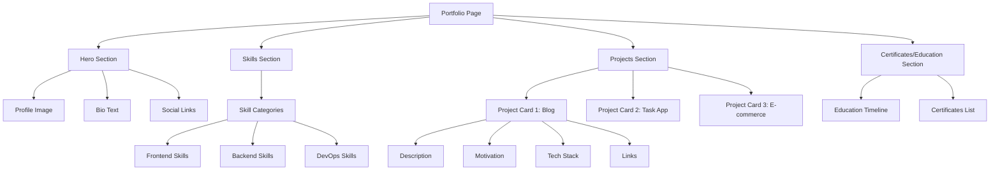

# Portfolio Page Implementation Plan

Based on the information provided and analysis of the current blog's structure and styling, this document outlines a detailed plan for transforming the `/about` page into a new `/portfolio` page that maintains the blog's design aesthetic while showcasing skills and projects.

## Overview

The new `/portfolio` page will replace the current `/about` page and feature a consistent design with the blog's dark theme, blue accents, and rounded card components. It will be fully responsive and organized into distinct sections with clear visual hierarchy.

## Page Structure



## Implementation Details

### 1. File Structure Changes

- Rename `/about` directory to `/portfolio` in the app router structure
- Update the Header component to replace "About" link with "Portfolio"
- Create necessary styling for new components

### 2. Component Structure

1. **Hero Section**
   - Large profile image (reuse avatar from AboutMe component)
   - Professional bio with highlighted key strengths
   - Social/contact links with icons

2. **Skills Section**
   - Organized by category (Frontend, Backend, DevOps)
   - Visual representation with skill level indicators
   - Animation for better engagement

3. **Projects Section**
   - Project cards with consistent styling
   - Each card includes:
     - Project title and thumbnail/screenshot
     - Description of functionality
     - Motivation/problem solved
     - Tech stack used (with icons)
     - Links to repository and live demo

4. **Certificates/Education Section**
   - Timeline or card-based layout
   - Education history
   - Professional certifications
   - Continuing education

### 3. Styling Approach

The portfolio page will maintain the blog's aesthetics:
- Dark background with blue accents
- Neumorphic card design with subtle shadows
- Rounded corners for all containers
- Interactive hover effects
- Consistent typography matching the blog

```css
/* Example styling concepts */
.portfolio-section {
  background: linear-gradient(145deg, #181818, #222222);
  border-radius: 1rem;
  padding: 2.5rem;
  margin-bottom: 2.5rem;
  box-shadow: 0 10px 25px -5px rgba(0, 0, 0, 0.3);
  border: 1px solid #2a2a2a;
}

.project-card {
  background: var(--surface);
  padding: 1.5rem 2rem;
  border-radius: 16px;
  margin: 1.5rem 0;
  box-shadow: 6px 6px 12px #0a0a0a, -6px -6px 12px #1a1a1a;
  transition: all 0.3s cubic-bezier(0.25, 0.8, 0.25, 1);
}
```

### 4. Responsive Design Considerations

- Mobile-first approach with responsive breakpoints
- Flex/grid layout that adapts to screen size
- Collapsed sections on mobile with easy navigation
- Optimized images for different screen sizes

## Implementation Steps

1. Create the new portfolio page component structure
2. Update the Header component navigation link
3. Implement the Hero section with reused AboutMe styling
4. Build the Skills section with visual indicators
5. Develop the Projects section with card components
6. Create the Certificates/Education section
7. Add animations and interactive elements
8. Ensure responsive design works on all device sizes
9. Test and verify all sections render correctly

## Technical Implementation

### File Structure

```
src/src/app/portfolio/
└── page.tsx       # Main portfolio page component

src/src/components/portfolio/
├── Hero.tsx       # Hero section with bio and image
├── Skills.tsx     # Skills showcase section
├── Projects.tsx   # Projects showcase section
└── Education.tsx  # Certificates and education section
```

### CSS Updates

We'll need to add styling for the portfolio components in the globals.css file, following the existing styling patterns for consistency.

### Data Structure

For skills and projects, we'll use structured data like:

```typescript
// Skills data structure
interface Skill {
  name: string;
  level: number; // 1-5
  category: 'frontend' | 'backend' | 'devops';
  icon?: string;
}

// Project data structure
interface Project {
  title: string;
  description: string;
  motivation: string;
  techStack: string[];
  repoUrl?: string;
  demoUrl?: string;
  image?: string;
}
```

This structured approach will make it easy to update or extend the portfolio in the future.