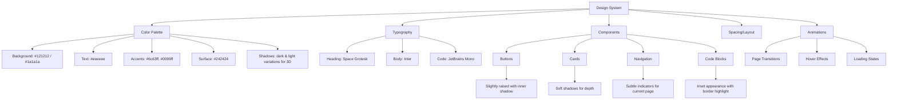
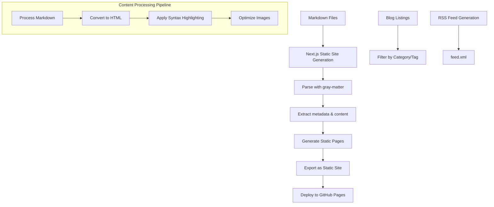
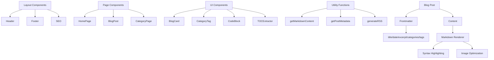

# Personal Blog Project Plan

## Technology Stack
- **Framework**: Next.js with TypeScript
- **Styling**: Tailwind CSS with Dark Neumorphism theme
- **Content**: Markdown files in repository
- **Deployment**: GitHub Pages

## Project Features
- Blog posts list, categories/tags, and individual post pages
- Dark Neumorphism design with 3D effects and microinteractions
- Code snippet support with syntax highlighting
- Fully responsive design for all devices (mobile, tablet, desktop)
- Static site generation for optimal performance
- No analytics, search, or commenting functionality initially

## Design System

### Visual Design (Dark Neumorphism)



### Key Design Elements

- **3D Effects**: Subtle elevation using box-shadow combinations
- **Microinteractions**:
  - Buttons slightly depress on click
  - Nav items glow on hover
  - Cards subtly rise on hover
- **Page Transitions**: Fade transitions between pages
- **Layout**:
  - Clean header with name/logo on left, navigation on right
  - Content area with comfortable reading width (65-70 characters)
  - Footer with minimal information

## Project Structure

```mermaid
graph TD
    A[my-blog] --> B[public]
    A --> C[src]
    A --> D[.github]
    A --> E[content]
    
    B --> B1[images]
    B --> B2[fonts]
    B --> B3[favicon.ico]
    
    C --> C1[components]
    C --> C2[pages]
    C --> C3[styles]
    C --> C4[lib]
    C --> C5[types]
    C --> C6[utils]
    
    C1 --> C1a[layout]
    C1 --> C1b[blog]
    C1 --> C1c[ui]
    
    C2 --> C2a[index.tsx]
    C2 --> C2b[blog]
    C2 --> C2c[category]
    
    C2b --> C2b1[[slug].tsx]
    C2c --> C2c1[[category].tsx]
    
    D --> D1[workflows]
    D1 --> D1a[deploy.yml]
    
    E --> E1[posts]
```

## Enhanced Technical Architecture

### Data Flow Architecture



## Implementation Plan (2-Week Timeline)

### Week 1: Foundation & Core Features

#### Days 1-2: Project Setup & Basic Structure
- Initialize Next.js project with TypeScript
- Set up Tailwind CSS with Dark Neumorphism theme
- Configure ESLint and Prettier
- Create basic project structure
- Set up GitHub repository
- Implement basic layout components (Header, Footer)

#### Days 3-4: Content Management
- Set up markdown processing with gray-matter and remark
- Create utility functions for reading/parsing markdown
- Implement dynamic page generation for blog posts
- Set up syntax highlighting for code blocks

#### Days 5-7: Core Pages & Navigation
- Develop home page with blog listing
- Implement dynamic blog post page
- Add category/tag filtering functionality
- Create category pages
- Add pagination for blog listings
- Ensure responsive design for all screen sizes

### Week 2: Design Polish & Deployment

#### Days 8-9: Design Implementation
- Apply Dark Neumorphism styling
- Implement microinteractions and hover effects
- Add page transition animations
- Optimize typography for readability
- Ensure consistent styling across the site

#### Days 10-11: Optimization & Testing
- Optimize images and assets
- Implement lazy loading for images
- Test performance using Lighthouse
- Fix any bugs or UI issues
- Test on different devices and browsers

#### Days 12-14: Deployment & Documentation
- Set up GitHub Actions for automatic deployment
- Deploy to GitHub Pages
- Set up custom domain (if applicable)
- Create documentation for content creation workflow
- Write README with setup and contribution guidelines

## Component Architecture



## Technical Details

### Markdown Post Structure (Enhanced)
```markdown
---
title: 'Post Title'
date: '2023-05-15'
excerpt: 'A brief summary of the post content'
coverImage: '/images/posts/cover.jpg'
categories: ['react', 'nextjs']
tags: ['hooks', 'performance', 'tutorial']
readingTime: '5 min'
---

# Post Title

Introduction paragraph with a brief overview of what the post is about.

## Section Heading

Regular paragraph with **bold text** and *italic text*.

### Subsection

```tsx
// Code example with syntax highlighting
function Example() {
  const [count, setCount] = useState(0);
  return (
    <div>
      <p>You clicked {count} times</p>
      <button onClick={() => setCount(count + 1)}>
        Click me
      </button>
    </div>
  );
}
```

More content with [links](https://example.com) and lists:

- Item 1
- Item 2
- Item 3

## Conclusion

Summary paragraph with key takeaways.
```

### GitHub Pages Deployment Workflow
```yaml
name: Deploy to GitHub Pages

on:
  push:
    branches: [main]

jobs:
  build-and-deploy:
    runs-on: ubuntu-latest
    steps:
      - name: Checkout
        uses: actions/checkout@v3
        
      - name: Setup Node.js
        uses: actions/setup-node@v3
        with:
          node-version: '18'
          
      - name: Install dependencies
        run: npm ci
        
      - name: Build
        run: npm run build && npm run export
        
      - name: Deploy
        uses: JamesIves/github-pages-deploy-action@v4
        with:
          branch: gh-pages
          folder: out
          clean: true
```

### Next.js Configuration for GitHub Pages
```js
/** @type {import('next').NextConfig} */
const nextConfig = {
  reactStrictMode: true,
  output: 'export',
  images: {
    unoptimized: true,
  },
  basePath: process.env.NEXT_PUBLIC_BASE_PATH || '',
  assetPrefix: process.env.NEXT_PUBLIC_BASE_PATH || '',
}

module.exports = nextConfig
```

## Future Expansion Considerations

1. **Portfolio Integration**
   - Project showcase component
   - Project filtering system
   - Interactive project demos

2. **Performance Enhancements**
   - Image optimization with next/image
   - Implement ISR for semi-dynamic content
   - Add service worker for offline support

3. **Additional Features**
   - Search functionality
   - Newsletter subscription
   - Reading progress indicator
   - Dark/light mode toggle
   - SEO optimization