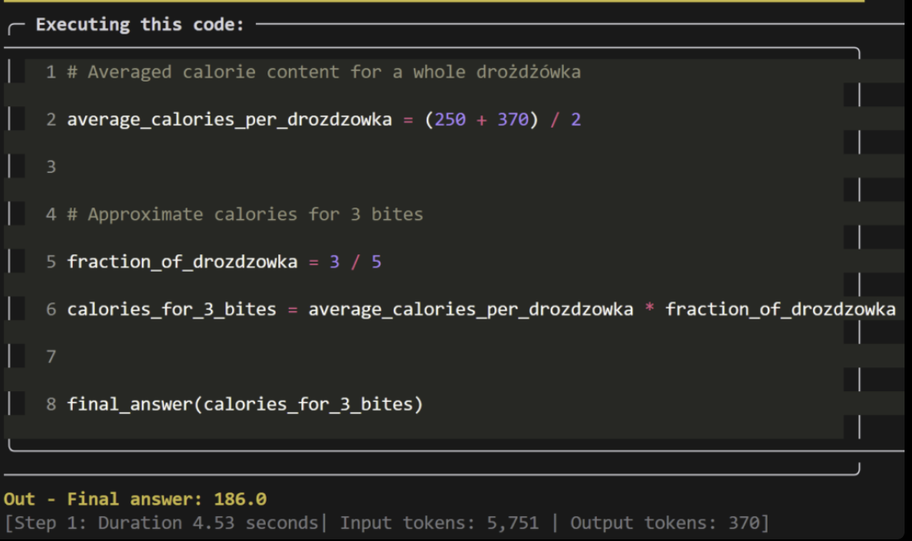
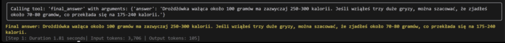

# SmolAgents: Building Custom AI Agents with Hugging Face

Hugging Face's SmolAgents library is a simple yet powerful tool for building custom agents powered by Large Language Models (LLMs). But what exactly are "agents" and why should you use them? In this post, you'll learn more about this topic.

## What are AI Agents?

AI agents are systems that use language models as their engine, but their functionality goes beyond just generating text. They can perform tasks by utilizing tools, processing data, or making decisions based on predefined rules.

## Why SmolAgents?

SmolAgents stands out for several key features:

1. **Simplicity** – The agent logic fits in ~1000 lines of code, allowing you to focus exclusively on the most important elements.
2. **Support for any LLM** – Agents can be powered by models from Hugging Face, OpenAI, Anthropic, and others.
3. **Code Agents** – Support for agents that generate Python code while performing tasks.
4. **Integration with Hugging Face Hub** – You can share and load tools and other resources directly from the Hub community.

## How to Build an Agent?

To create a minimal agent, you need to define two key elements:

1. **Model** – The text generation engine:
   * **TransformersModel** – Pipeline for local data processing.
   * **HfApiModel** – Uses the Hugging Face Inference API.
   * **LiteLLMModel** – Supports over 100 models through LiteLLM.
   
2. **Tools** – A list of functions that the agent can use. Tools are described with a name, description, input and output types.

Example:

```python
from smolagents import CodeAgent, DuckDuckGoSearchTool, LiteLLMModel

model = LiteLLMModel(model_id="gpt-4o")
agent = CodeAgent(tools=[DuckDuckGoSearchTool()], model=model)

agent.run("I'm eating a pastry right now, I think I've taken about 3 larger bites. How many calories would that be?")
```

## Python vs JSON

### Generating and Executing Python Code - CodeAgent

With **CodeAgent**, the agent not only makes decisions but also generates and executes Python code during operation. For example, if an agent needs to calculate a Fibonacci number, it will write and run an appropriate Python script in the runtime environment.

Additionally, it will generate and execute Python code. For example, when running the above example, the agent will first find the caloric value of a pastry and the average size of a bite, then calculate the appropriate caloric value based on this code.



Special features:
* **Local code execution** – The agent runs generated code in a secure Python environment.
* **Security limitations** – By default, only selected functions and modules can be used. To increase flexibility, additional imports can be authorized.
* **Risk** – Without proper restrictions, generating and executing dangerous code could expose the system to attacks.

### Returning Responses in JSON Format - **ToolCallingAgent**

**ToolCallingAgent** works differently. Instead of generating and executing code, the agent uses tools by creating requests in JSON format.

Example:

```python
from smolagents import ToolCallingAgent, DuckDuckGoSearchTool, LiteLLMModel

model = LiteLLMModel(model_id="gpt-4o")
agent = ToolCallingAgent(tools=[DuckDuckGoSearchTool()], model=model)

agent.run("I'm eating a pastry right now, I think I've taken about 3 larger bites. How many calories would that be?")
```


**Special features**:
* **Security** – No coding and code execution takes place in the local environment. Instead, the agent generates a "request" in JSON format describing the task that the tool should perform.
* **Transparency** – The agent operates based on defined tools whose API specifies: name, description, input and output types. This makes it easy to control what tasks the agent can perform.
* **Less flexibility** – Compared to **CodeAgent**, **ToolCallingAgent** is less flexible but much more predictable.